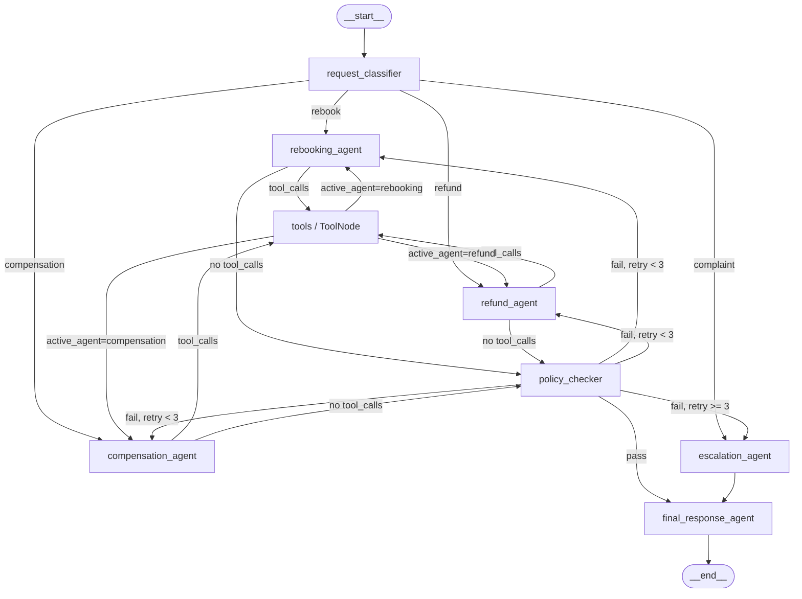

# ✈️ Flight Disruption handling Assistant

A LangGraph-powered multi-agent system that handles airline disruptions (cancellations and delays).
Passengers send a message; the system classifies their intent, dispatches a specialist agent, validates the solution against policy, and replies — all in one deterministic, checkpointed graph.

---

## Quick Start

```bash
# 1. Create and activate a virtual environment
python3 -m venv venv
source venv/bin/activate

# 2. Install dependencies
pip install -r requirements.txt

# 3. Set your xAI Grok API key
cp .env.example .env
# Edit .env and add your XAI_API_KEY

# 4. Run all 4 scenarios + the follow-up
python main.py
```

---

## Graph Diagram



---

## Node Responsibilities

| Node | Type | Responsibility |
|------|------|----------------|
| `request_classifier` | LLM + structured output | Extracts `intent` (rebook/refund/compensation/complaint) and `constraints` from the passenger's message |
| `rebooking_agent` | LLM + tools | Calls `get_booking` and `search_flights`, then proposes a new flight using structured output |
| `refund_agent` | LLM + tools | Calls `get_booking` and `get_fare_rules`, then proposes a refund amount |
| `compensation_agent` | LLM + tools | Calls `get_booking`, reads disruption details, proposes a compensation amount |
| `tools` | `ToolNode` (prebuilt) | Executes whichever tool the specialist agent called; routes result back via `active_agent` |
| `policy_checker` | Pure Python | Validates the proposed solution against airline rules; increments `retry_count` on failure |
| `escalation_agent` | LLM | Writes a handover note for a human agent when resolution fails or intent is complaint |
| `final_response_agent` | LLM | Writes the final passenger-facing reply; includes escalation notice if applicable |

---

## State Design (`RebookingState`)

```python
class RebookingState(TypedDict):
    messages: Annotated[list[AnyMessage], add_messages]  # reducer — appends; never overwrites
    request_id: str
    booking_ref: str
    intent: Optional[str]           # rebook | refund | compensation | complaint
    constraints: Optional[str]      # e.g. "must arrive by noon tomorrow"
    booking_details: Optional[dict] # fetched via get_booking tool
    proposed_solution: Optional[dict]
    policy_check_result: Optional[str]  # "pass" | "fail"
    failure_reason: Optional[str]
    retry_count: int                # 0 → 1 → 2 → 3 then escalate
    escalation_status: bool
    escalation_note: Optional[str]  # written by escalation_agent
    final_response: Optional[str]
    active_agent: Optional[str]     # routing helper for ToolNode → specialist
```

Design decisions:
- `add_messages` reducer lets every node append without clobbering history.
- `active_agent` is the only cross-cutting field; all other fields are owned by one node.
- `retry_count` is initialised to `0` at graph entry and only incremented by `policy_checker` on failure — this guarantees the cycle always terminates.

---

## Routing Logic (Conditional Edges)

### Edge 1 — `request_classifier` → specialist (`route_intent`)
| Intent | Destination |
|--------|------------|
| `rebook` | `rebooking_agent` |
| `refund` | `refund_agent` |
| `compensation` | `compensation_agent` |
| `complaint` (or unknown) | `escalation_agent` |

### Edge 2 — Specialist agent → `tools` or `policy_checker` (`tools_condition`)
Uses the **prebuilt `tools_condition`** from `langgraph.prebuilt`:
- If the agent's last message contains `tool_calls` → `tools`
- Otherwise → `policy_checker`

### Edge 3 (from ToolNode) — `tools` → same specialist (`route_back_from_tools`)
Reads `active_agent` from state and routes back to the correct specialist.

### Edge 4 — `policy_checker` → pass/retry/escalate (`route_policy`)
| Condition | Destination |
|-----------|------------|
| `policy_check_result == "pass"` | `final_response_agent` |
| fail + `retry_count < 3` | same specialist (the **cycle**) |
| fail + `retry_count >= 3` | `escalation_agent` |

The `retry_count >= 3` guard **guarantees the graph always terminates**.

---

## Policy Rules

### Rebooking
- Cabin class must be **same or lower** than original booking
- Flight must depart **within 48 hours**
- Minimum connection time: **60 minutes**

### Refund
| Situation | Refund |
|-----------|--------|
| Airline cancelled the flight | Full fare |
| Passenger choice, non-refundable fare | Taxes only |

### Compensation
| Delay | Amount |
|-------|--------|
| Under 3 hours | $0 |
| 3 – 6 hours (inclusive) | $200 |
| Over 6 hours OR cancelled | $400 |

---

## Tools (Mock Data)

All tools return fixed fake data — results are deterministic across every run.

### `get_booking(booking_ref: str) → dict`
Returns: `passenger`, `route`, `cabin_class`, `fare_type`, `disruption_details`, `origin`, `destination`

### `search_flights(origin: str, destination: str, date: str) → list`
Returns: list of `{flight_no, departure, arrival, cabin, connection_time, departs_in_hours}`

> The CDG→JFK route intentionally returns **only a Business-class seat** so that Scenario 3 always fails the cabin-class policy check, exercising the retry cycle.

### `get_fare_rules(fare_type: str) → dict`
Returns: `{refundable: bool, tax_amount: int}`

---

## Checkpointer & Persistence

The graph is compiled with **`MemorySaver`**:

```python
checkpointer = MemorySaver()
graph = build_graph().compile(checkpointer=checkpointer)
```

Each conversation uses a unique `thread_id`:
```python
config = {"configurable": {"thread_id": "thread_sc1"}}
```

The follow-up message in Scenario 1 reuses `"thread_sc1"` without passing `booking_ref` again — LangGraph restores the full state from the checkpoint automatically.

---

## Four Test Scenarios

### Scenario 1 — Cancelled flight, must arrive by noon
**Input:** `"My flight to Dubai was cancelled. I need to be there by tomorrow noon."`  
**Booking:** XK9L2P (LHR→DXB, Economy, refundable, cancelled)  
**Expected path:** Classifier → Rebooking ⇄ Tools → Policy checker (pass) → Final response

### Scenario 1 Follow-up
**Input:** `"Actually, can I get a refund instead?"`  
**Same thread_id** — booking_ref and history reused from checkpoint.  
**Expected path:** Classifier → Refund → Policy checker (pass) → Final response

### Scenario 2 — 6-hour delay, compensation request
**Input:** `"My flight is delayed 6 hours. Am I entitled to anything?"`  
**Booking:** B77XYZ (JFK→LHR, Business, non-refundable, 6-hour delay)  
**Expected path:** Classifier → Compensation → Policy checker (pass, $200) → Final response

### Scenario 3 — Only Business class available (retry loop)
**Input:** `"My flight was cancelled. I need to be rebooked."`  
**Booking:** C88ABC (CDG→JFK, Economy, refundable, cancelled)  
Mock data returns only Business-class seats → policy fails 3 times.  
**Expected path:** Classifier → Rebooking ⇄ Policy checker (fails 3×) → Escalation → Final response

### Scenario 4 — Complaint, wants a manager
**Input:** `"This is the third time you've cancelled on me. I want to speak to a manager."`  
**Booking:** D99DEF (SYD→LAX, Economy)  
**Expected path:** Classifier → Escalation → Final response

---

## Bonus Features Implemented

- **Human-in-the-loop** (`interrupt()`): The `policy_checker` pauses the graph and requests supervisor approval for any refund or compensation exceeding **$300** before the final response is sent and if the intent is re-booking and if constraint is not given then it stops and asks the user to give the constraint .

---

## Project Structure

```
airline_assistant/
├── .env.example          # Required environment variables
├── requirements.txt      # Python dependencies
├── state.py              # RebookingState TypedDict
├── tools.py              # Mock tools: get_booking, search_flights, get_fare_rules
├── nodes.py              # All 7 node functions + LLM configuration
├── graph.py              # StateGraph construction + routing functions
├── main.py               # Runs all 4 scenarios + follow-up; saves graph diagram
└── README.md             # This file
```
